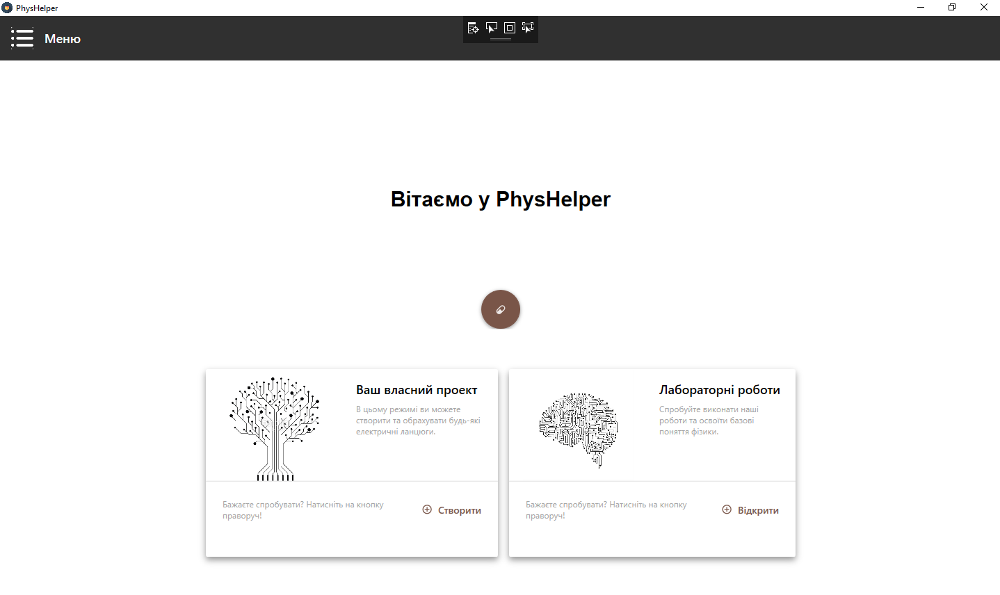
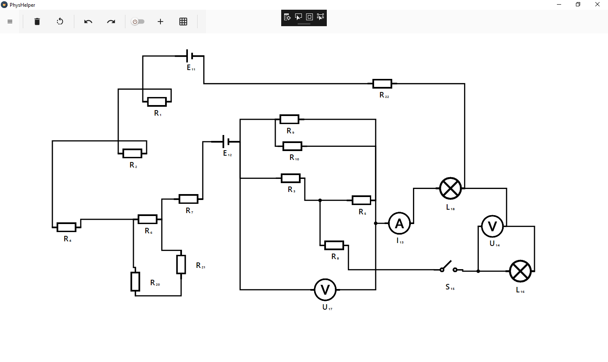

# PhysHelper

This project was developed for Young Programmers Tournament 2017 in Ukraine. Physhelper is a desktop application that helps students to learn physics and do scientific experiments.
## Modern design

  

## Create your own circuits 

  

## Usage
This is not open-source product. Instructions for building and using this app could be given upon request.
